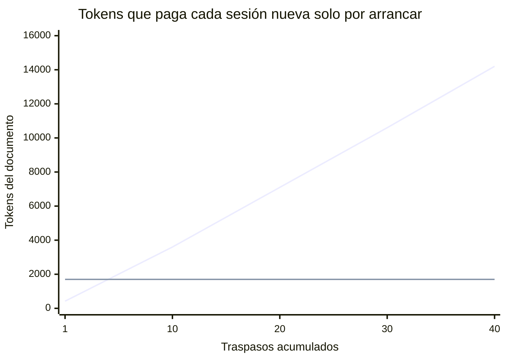
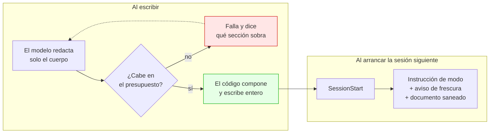
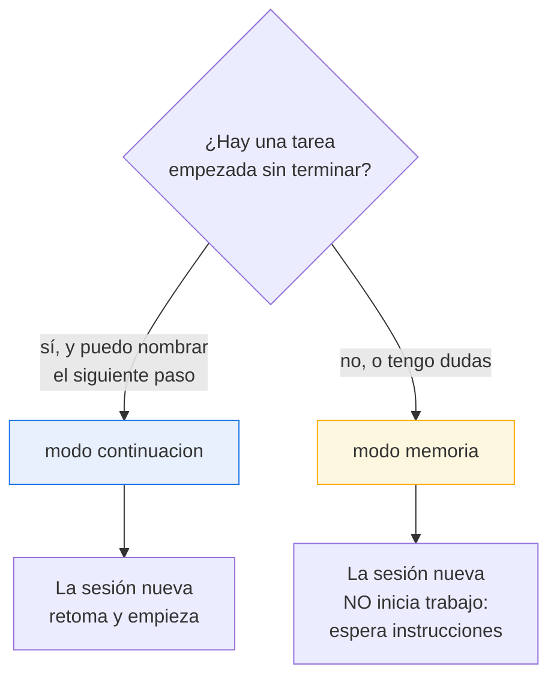
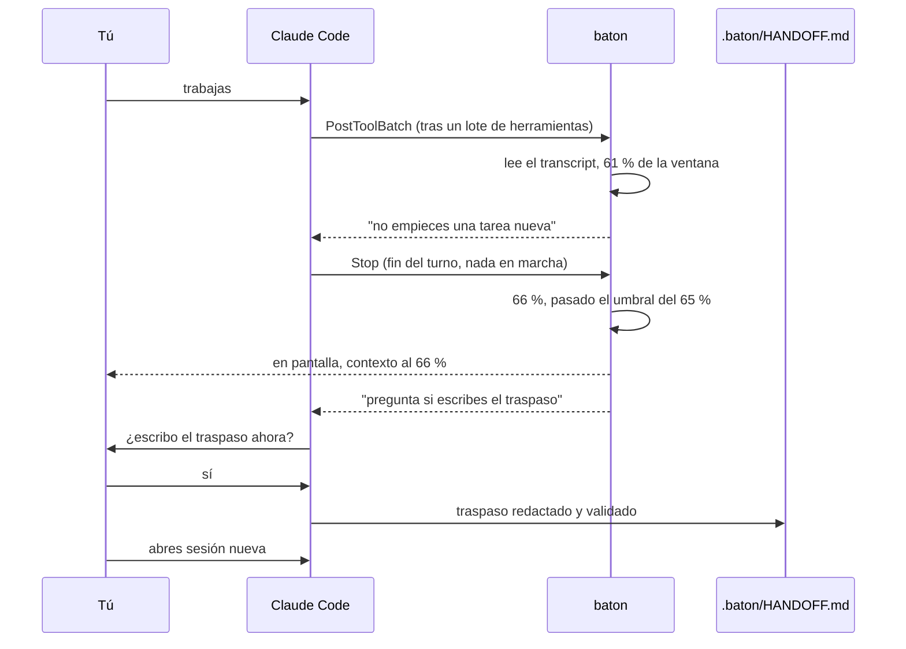
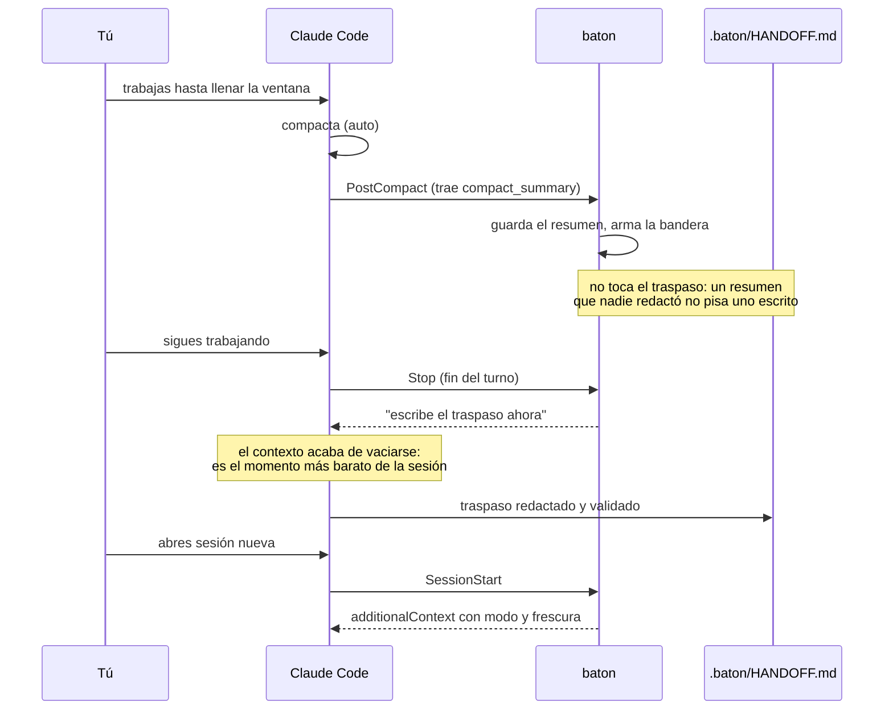
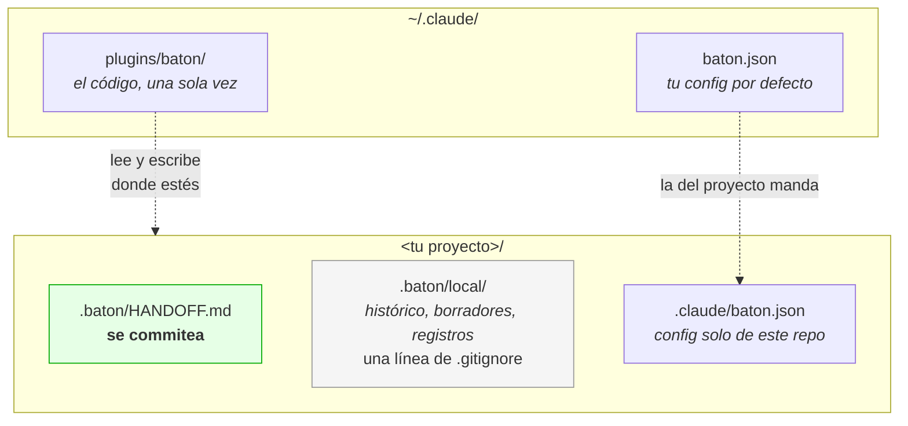
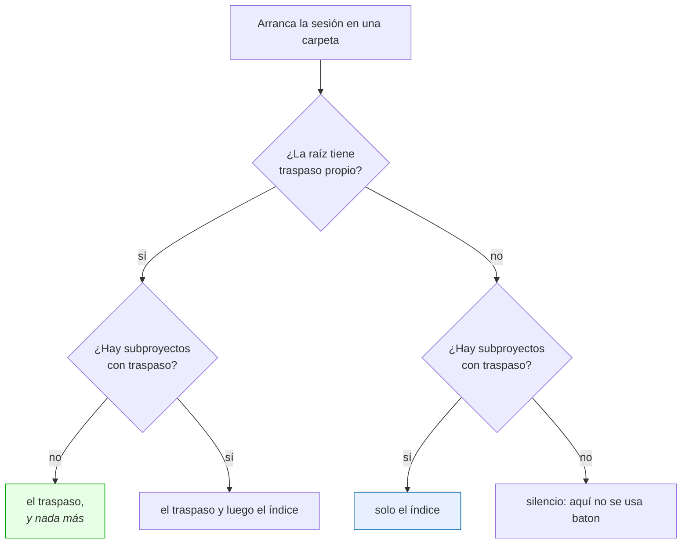

# baton

**Traspaso de contexto entre sesiones de Claude Code con un documento que no crece.**

*[English](README.md) · **Español***

[](tests/)
[](#requisitos)
[](LICENSE)

---

## El problema

Cuando una sesión de Claude Code se alarga, la calidad se degrada y toca abrir una
nueva. El traspaso es manual, y los plugins que lo automatizan comparten un fallo
medido: **el documento crece sin límite**.



La línea de arriba es un caso real: **931 líneas ≈ 14.200 tokens**. El documento
que existía para *ahorrar* contexto acabó siendo el mayor consumidor de contexto
del arranque.

Y hay algo peor, verificado en el binario de Claude Code 2.1.259: el contexto que
un hook inyecta **se trunca a 8.000 caracteres o 200 líneas, y en silencio**.


Un traspaso así **no cabe**. Llega cortado por la mitad y nadie avisa: el modelo lee
media frase y la trata como si estuviera entera.

## Cómo lo resuelve baton



- **Se reescribe entero, nunca se añade.** Un fichero, sin entradas apiladas.
- **Presupuesto duro verificado por código**: 120 líneas / 6.000 caracteres,
  derivados hacia atrás desde el techo real del harness. Si no cabe, el comando
  **falla y dice qué sección sobra** — no trunca a media frase, porque un traspaso
  cortado miente. Al tercer intento fallido baton escribe él un traspaso mínimo,
  conserva la sección obligatoria y declara el recorte dentro del documento: un
  corte que lo dice vale más que un modelo dando vueltas sobre un presupuesto que
  no consigue cumplir.
- **Secciones opcionales de verdad.** Si no hay bloqueos, la sección *no existe*.
  Nada de «Bloqueos: ninguno»: los huecos son por donde engordan los demás.
- **Los datos de git los pone el código**, no el modelo: rama, commit, ficheros sin
  commitear, fecha. Exactos y sin gastar presupuesto.

## Los dos modos

Este es el diferenciador, y ningún plugin equivalente lo tiene: los demás asumen
que siempre hay trabajo a medias, así que la sesión nueva arranca sola y toca lo
que nadie pidió.



| | `continue` | `memory` |
|---|---|---|
| Cuándo | Hay tarea a medias | Hay progreso, nada que continuar |
| Exige `Siguiente paso` | Sí, el código lo verifica | No |
| La sesión nueva | Confirma y empieza | Saluda y **espera** |

Esperar no es callar. Dile *continuemos* o *en qué quedamos* y una sesión en
`memory` te cuenta qué deja abierto el documento y te pregunta por cuál seguir,
sin abrir un fichero, porque contar no es empezar.

Ante cualquier ambigüedad —frontmatter roto, documento corrupto, versión
desconocida— baton cae a `memory`. Un documento ilegible nunca puede autorizar a
continuar trabajo.

## El ciclo automático

Mientras trabajas no estás pensando en traspasar. baton sí, en dos momentos, los
dos al terminar un turno, cuando no hay nada en marcha: cuando la ventana de
contexto empieza a llenarse, y justo después de que el harness compacte.

### Antes de que el harness compacte: la ventana de contexto

Una compactación es el harness decidiendo por ti qué sobrevive de la conversación,
y lo decide cuando la ventana se llena, no cuando tú estás listo para cortar.
baton llega antes:



- **Al 60 %**, tras un lote de herramientas, se le dice al modelo una sola vez que
  no empiece una tarea nueva y termine la que tiene en curso.
- **Al 65 %**, al terminar el turno —el único momento en que no hay nada en
  marcha, ni herramientas ni subagentes—, baton le pide al modelo que **te
  pregunte**, en una línea, si escribe el traspaso. No se escribe nada hasta que
  respondas. Si dices que no, no vuelve a preguntar en ese umbral.
- **Al 85 %**, si seguiste trabajando igualmente, pregunta una vez más, y el
  traspaso se reescribe entero: el del 65 % ya envejeció.

**Cómo sabe cuánto se ha llenado la ventana.** Los hooks no reciben ningún dato
del contexto. El transcript de la sesión sí: cada respuesta guarda el `usage` de
su petición, y `input_tokens + cache_creation_input_tokens + cache_read_input_tokens`
es exactamente el contexto que ocupó esa petición —la misma suma que pinta la
statusline—. El tamaño de la ventana sale del modelo: baton lleva la tabla que usa
el propio Claude Code, y lee el modelo del transcript *con* su sufijo `[1m]`,
porque `message.model` nunca lo trae. La frontera no va por familias —dentro de
Opus cambia en 4.7, dentro de Sonnet en 5—, y por eso es una tabla y no una regla.

Un modelo más nuevo que la tabla arranca en 200k y se **aprende**: una sesión que
llega a N tokens es la prueba de que la ventana tiene al menos N, así que el tamaño
solo sube. `CLAUDE_CODE_MAX_CONTEXT_TOKENS`, `CLAUDE_CODE_AUTO_COMPACT_WINDOW`, el
ajuste `autoCompactWindow` de Claude Code y `context_window.budget_tokens` mandan
sobre la tabla.

**Por qué los umbrales se quedan en 95.** Redactar un traspaso cuesta unos miles
de tokens. Al 65 % no es nada; en el mismo borde podría disparar la compactación
que existe para adelantar.

### Después de que el harness compacte

Si el disparo por ventana estaba apagado, lo rechazaste o un turno muy largo lo
adelantó, la compactación llega igual. baton también la atrapa:



**Por qué pedirlo justo después.** El contexto acaba de vaciarse y el resumen está
fresco: es el momento más barato de la sesión para redactar.

`PreCompact` no sirve para esto: en la compactación no hay turno de modelo. El
propio binario lo dice al rechazar los hooks que requieren conversación —
*"no conversation context is available"*.

**Como mucho una interrupción por umbral y por compactación**, con anti-bucle
nativo (`stop_hook_active`) y un cooldown de 30 minutos que comparten las dos
razones: lo que protege eres tú, no un mecanismo. Si las dos tocan a la vez, gana
la compactación: su resumen es mejor material, y el umbral queda disponible.

**El resumen es insumo, nunca producto.** Un resumen de compactación real ocupó
**12.780 bytes** frente a un presupuesto de 6.000 caracteres. Guardarlo tal cual
como traspaso —lo cómodo, y lo que haría un diseño ingenuo— duplicaría el tope y
ni siquiera cabría en el techo de 8.000. En su lugar se destila: esa misma sesión
produjo un traspaso de 45 líneas, 2.763 caracteres inyectados.

## Frescura: avisar, nunca caducar

Un traspaso de hace días con commits encima miente. Al inyectarlo, baton compara
con git y lo dice:

> `[baton] Aviso de frescura: este traspaso se escribió hace 6 días, en la rama`
> `feature/cupones, y ahora estás en main. Desde entonces hay 14 commits nuevos y`
> `9 ficheros cambiados. Da por incierto lo que diga del estado del código.`

También detecta que el commit desapareció (rebase o squash). **Nunca caduca**: un
proyecto parado dos semanas no invalida su traspaso, solo hay que saber que es
viejo. Y si no hay nada que decir, no gasta ni una línea.

**También avisa cuando se repite.** Un traspaso que llega a una sesión que ya lo
recibió viene con la cuenta y la fecha de la última vez. El trabajo que no ha
avanzado no es novedad, y sin esa línea la sesión nueva lo lee como si lo fuera.

## Qué ves al arrancar una sesión

El traspaso va al contexto del modelo, así que nunca llega a tu pantalla. Por eso
baton imprime lo que quedó pendiente en la línea del recibo, antes de que
escribas nada:

```
baton: traspaso inyectado -- modo memory, 47 líneas, escrito hace 2 h, y el código cambió
  Bloqueos
  1. La pregunta que cerró la sesión: ¿sigo con el pesado, hago primero los cuatro livianos
     para bajar la cola, o cortamos?
  2. Pregunta de seguridad abierta: si algún día quieren dar acceso a solo ciertos locales,
     decidirlo después cuesta mucho más que decidirlo ahora.
  (también en el documento: Estado, Decisiones y su porqué, Trampas)
```

**Lo largo se envuelve, nunca se corta.** Un traspaso cortado a media frase miente,
que es el argumento sobre el que se sostiene el plugin entero, así que el recibo
gasta su presupuesto en puntos completos y cuenta los que no cupieron. Se respeta
la numeración del autor — numeró las preguntas para que una respuesta pueda nombrar
una — y la continuación de un punto cuelga bajo su propio texto, así que una marca
en el margen izquierdo se ve como un punto nuevo.

**Se extrae, no se resume.** baton no escribe prosa sobre tu trabajo: toma la
sección tal cual y corta por líneas enteras. Qué sección depende de qué quedó,
porque lo que queda no siempre es una pregunta:

| Si el documento trae | Ves |
|---|---|
| Bloqueos, o preguntas que nadie respondió | eso, primero |
| Sin bloqueos pero con un siguiente paso escrito | el siguiente paso |
| Ninguno de los dos, solo estado | el estado, que siempre dice qué falta |
| Modo `continue` | el siguiente paso primero, que es de lo que va el modo |
| Varios proyectos y ninguno cargado | la lista, con modo y antigüedad |

Lo importante no es la lectura. Es que tu primer mensaje deje de ser
«continuemos» y pase a ser la decisión. Es una instrucción mejor, y además es lo
que nombra la sesión en `/resume`: el nombre se genera de tu primer mensaje,
antes de cualquier respuesta, y se genera una sola vez.

`receipt_lines` dice cuántas líneas puede añadir bajo la primera. Es un tope, no
un objetivo: un traspaso con una sola cosa pendiente gasta dos líneas diga lo que
diga el tope. Con `0` queda solo la primera línea.

Las líneas se envuelven a una medida legible, nunca al ancho completo de la
ventana. Un terminal ancho lleno de borde a borde se lee peor, y una línea medida
contra él se sale de la sangría en la que el harness la imprime — y entonces el
terminal parte el resto contra la columna cero, debajo de nada, deshaciendo la
estructura.

## Instalación

```bash
claude plugin marketplace add mrshelll/baton
claude plugin install baton@baton
```

> [!IMPORTANT]
> **Reinicia Claude Code después de instalar.** Los hooks se cargan al arrancar:
> sin reinicio no disparan, y un hook que no dispara no da error — no da nada.
> Es el error número uno.

Comprueba que quedó bien:

```bash
/hooks                                    # baton en SessionStart, PostCompact y Stop
python3 "${CLAUDE_PLUGIN_ROOT}/scripts/baton.py" doctor
```

## Uso

```bash
/baton                                    # eso es todo
/baton no retomes, solo ten esto presente # lo que sigue es una nota para el modelo
```

baton elige el modo y resuelve a qué proyecto pertenece el traspaso. La nota es
texto libre: qué quieres que capture, o el modo que quieres.

Y para inspeccionar:

```bash
python3 "${CLAUDE_PLUGIN_ROOT}/scripts/baton.py" show      # resumen y coste
python3 "${CLAUDE_PLUGIN_ROOT}/scripts/baton.py" doctor    # por qué no funciona
```

`context`, `write` y `load` completan la CLI, y quien los ejecuta es el skill:
son los pasos de un `/baton`, no otra forma de usarlo.

## Cómo se ve un traspaso

```markdown
---
baton: 1
mode: continue
fecha: 2026-09-03T00:54:51-05:00
rama: feature/cupones
commit: a3f9c21
---
<!-- Generado por baton. Se REESCRIBE ENTERO en cada /baton. -->

## Contexto
- rama `feature/cupones`, 3 sin commitear: src/pagos.ts, src/cupon.ts, tests/pagos.test.ts
- ultimo commit `a3f9c21` feat: valida el cupón antes de cobrar (2026-09-02)

## Estado
Migrando el cobro de Stripe Charges a PaymentIntents. `src/pagos.ts` ya usa
PaymentIntents en el camino feliz y sus 4 tests pasan. Falta reembolso y webhook.

## Decisiones y su porque
- Idempotency key = `pedido_id`, no UUID nuevo — un reintento no puede cobrar dos veces.
- El cupón se valida antes de crear el PaymentIntent — si no, quedan intentos huérfanos.

## Siguiente paso
Implementar `reembolsar(pedido_id)` en `src/pagos.ts:214` con la misma idempotency key.

## Trampas
- `paymentIntents.confirm` devuelve 200 con `status: "requires_action"`. No es éxito.
```

**22 líneas de 120.** El frontmatter y `## Contexto` los pone el código; el modelo
solo escribe de `## Estado` hacia abajo.

## Dónde vive todo



Añade **una sola línea** a tu `.gitignore`:

```gitignore
.baton/local/
```

**Instalas una vez, a nivel de usuario, y funciona en todos tus proyectos.** baton
no lleva un registro de proyectos: cada hook recibe el directorio de la sesión y
trabaja ahí. En un proyecto donde nunca corriste `/baton`, el plugin está instalado
pero **inerte**: no crea ficheros ni escribe nada. El primer `/baton` lo activa.

Y **no necesitas git**. Si el proyecto es un repo, baton aprovecha rama y commits.
Si no lo es, funciona igual sin esos datos.

## Varios proyectos en una carpeta

A veces abres la sesión en una carpeta que *contiene* proyectos en vez de ser uno
— una carpeta de cliente, una fábrica de software, un monorepo. baton lo maneja
sin que declares nada:

**Un proyecto es cualquier carpeta bajo la raíz con su propio
`.baton/HANDOFF.md`.** La convención de rutas da igual; las carpetas sueltas y las
agrupadas se mezclan sin problema:

```
CLIENTE-X/                         RAIZ/
├── radar/                         ├── proyectos/
│   └── .baton/HANDOFF.md   ✓      │   ├── uno/.baton/HANDOFF.md   ✓
├── portal/                        │   └── dos/.baton/HANDOFF.md   ✓
│   └── .baton/HANDOFF.md   ✓      ├── suelto/.baton/HANDOFF.md    ✓
└── notas/                  ·      └── .baton/HANDOFF.md           ✓ (la raíz)
```

Al arrancar recibes un **índice**, no un documento: qué proyectos hay, en qué
modo y de cuándo son. No concede nada ni autoriza nada — todavía no has recibido
el contexto de ninguno.



Cuando dices en cuál trabajas, el modelo ejecuta `baton.py load <nombre>` y
recibe ese traspaso con el mismo envoltorio, el mismo aviso de frescura y el
mismo presupuesto que habría aplicado el hook. Eso además lo marca como **el
proyecto activo de la sesión**, así que un `/baton` a secas escribe ahí.

### Tú no escribes argumentos

`/baton` no lleva ninguno. El modo lo decide el modelo, y el destino sale del
disco, en este orden:

1. el proyecto cargado con `load` en esta sesión,
2. el proyecto en el que está parada la sesión — una carpeta de proyecto tiene su
   propio `.baton/`, así que baton se detiene ahí en vez de subir a la raíz.

Solo quedan dos situaciones, y en las dos baton se detiene y lo dice en vez de
adivinar — porque lo que estaría adivinando es qué traspaso se sobrescribe. Ni
siquiera una raíz con un único proyecto decide sola: ser el único proyecto en
disco no es prueba de que este traspaso sea suyo.

- **El primer traspaso de un proyecto**, cuando nadie ha decidido todavía si
  pertenece a una subcarpeta o a la raíz — tanto si la sesión está parada en esa
  carpeta como si está en la raíz hablando de ella. Es una decisión de una sola
  vez, una por proyecto, para siempre.
- **Varios proyectos y ninguno cargado**, cuando la sesión nunca dijo de cuál iba.

En las dos, el modelo te pregunta en una línea y pasa él la bandera. Tú contestas
con palabras.

La activación vive una sesión: un arranque nuevo la limpia, una compactación la
conserva.

El escaneo mira **dos niveles hacia abajo** por defecto, que cubre las dos formas
de arriba. Si tus proyectos están más hondos, se dice una vez en la config de la
raíz:

```json
{ "discovery": { "depth": 3 } }
```

Escanear más hondo cuesta tiempo real en cada arranque de cada proyecto del
disco, y por eso es una decisión y no un valor por defecto. `baton.py doctor`
reporta hasta dónde miró, qué encontró y cuál es el proyecto activo.

## Configuración

Todo es opcional. `~/.claude/baton.json` para tu preferencia general,
`<proyecto>/.claude/baton.json` para un repo concreto (este manda).

```json
{
  "limits": { "lines": 120, "characters": 6000, "tokens": 1700 },
  "document": ".baton/HANDOFF.md",
  "history_max": 10,
  "inject_on": ["startup", "clear", "compact", "resume", "fork"],
  "cooldown_minutes": 30,
  "receipt": true,
  "receipt_lines": 12,
  "language": "es",
  "discovery": { "depth": 2, "max_dirs": 400 },
  "context_window": {
    "enabled": true, "watch_at": 60, "thresholds": [65, 85],
    "confirm": true, "budget_tokens": 0, "min_tokens": 40000
  }
}
```

| Clave | Por defecto | Qué hace |
|---|---|---|
| `limits.characters` | `6000` | **Vinculante**: es lo que mide el harness |
| `limits.lines` | `120` | La que un humano ve y sabe arreglar |
| `limits.tokens` | `1700` | Informativa, no rechaza por sí sola |
| `document` | `.baton/HANDOFF.md` | Relativa a la raíz; sin `..` ni absolutas |
| `history_max` | `10` | Versiones previas guardadas; `0` desactiva |
| `inject_on` | los cinco | En qué arranques se inyecta |
| `cooldown_minutes` | `30` | Mínimo entre dos peticiones automáticas |
| `receipt` | `true` | Si baton imprime algo en pantalla al arrancar la sesión |
| `receipt_lines` | `12` | Líneas que el recibo añade bajo la primera; `0` deja solo la primera |
| `language` | `en` | Idioma de todo lo que lee un humano |
| `discovery.depth` | `2` | Cuántos niveles se buscan proyectos (1-4). **Solo en la raíz** |
| `discovery.max_dirs` | `400` | Tope de carpetas miradas por escaneo |
| `context_window.enabled` | `true` | El traspaso que se pide cuando la ventana se llena |
| `context_window.watch_at` | `60` | % en el que se le dice al modelo, una vez, que vaya cerrando; `0` lo apaga |
| `context_window.thresholds` | `[65, 85]` | % en los que baton pide el traspaso al terminar el turno: de 1 a 4 valores, ninguno por encima de 95 |
| `context_window.confirm` | `true` | Preguntarte antes de escribir; `false` escribe directamente |
| `context_window.budget_tokens` | `0` | Tamaño de la ventana en tokens; `0` lo deduce del modelo |
| `context_window.min_tokens` | `40000` | Por debajo de estos tokens no salta nada, diga lo que diga el porcentaje |

`cooldown_minutes` y `context_window` se leen de la carpeta donde corre la sesión,
no de un subproyecto cargado en ella.

**Las claves de config van en inglés en todos los idiomas.** Son una interfaz de
máquina, y quien las escribe no debería tener que hablar otro. `"language"` cambia
lo que lee la gente: los títulos de sección, los mensajes y las instrucciones que
se inyectan al modelo. Por ahora `en` y `es`; añadir uno es un fichero JSON en
`templates/`.

Un fichero de config roto no impide usar baton: avisa nombrando el fichero y sigue
con los valores buenos. Si escribes `lineas_max`, te sugiere `limits.lines`.

## Seguridad

`.baton/HANDOFF.md` se commitea y viaja con el repo, así que **quien clone un repo
ajeno se inyecta en su contexto lo que ese fichero diga**. baton lo trata como
entrada no confiable:

- Se eliminan caracteres de control, secuencias ANSI, marcas bidi y espacios de
  ancho cero.
- El contenido **no puede cerrar su propia etiqueta** para escaparse del bloque.
- Va precedido de una advertencia explícita de que es un documento de datos y no
  instrucciones.
- El modo se lee **solo** del frontmatter, que escribe el código: un cuerpo que
  finja otro modo no cambia nada.

**baton lee el transcript de la sesión.** Para saber cuánto se ha llenado la
ventana, los hooks que corren al terminar un turno y tras un lote de herramientas
leen los últimos 256 KB del transcript que Claude Code guarda de la sesión
(`transcript_path`), y su primer 1 MB cuando la identidad del modelo no está en la
cola. Las líneas se interpretan en memoria para sacar tres números —los contadores
de entrada de la última respuesta— y el id del modelo. Nada de lo que dice la
conversación se guarda, se registra ni se envía a ningún sitio: lo que llega al
disco es un recuento de tokens por modelo en `.baton/local/window.json`. El formato
es el interno de Claude Code y va a cambiar; cuando baton no lo entienda, se calla
en vez de adivinar.

## Comprobar que tu instalación funciona de verdad

Los tests unitarios no ven los fallos que solo aparecen en una instalación real.
Estas cinco comprobaciones sí, y son las que destaparon el bug de frescura de la
0.3.1 que 211 tests unitarios no habían visto. Llevan dos minutos.

**1. El hook dispara.** Abre una sesión en un proyecto donde hayas usado `/baton`.
La línea de arranque debe decir:

```
SessionStart:startup says: baton: traspaso inyectado -- modo memory, N líneas, escrito ...
```

Debajo debe salir lo que quedó: bloqueos, un siguiente paso o el estado. Si no
aparece ninguna línea, el hook no disparó. Ejecuta `doctor`.

**2. El modo memoria — la que define el producto.** Con un traspaso en `memory`,
abre una sesión nueva y escribe algo trivial y sin relación, por ejemplo `hola`.

- ✅ Saluda en una línea y espera.
- ❌ Abre ficheros, propone un plan, o pregunta «¿seguimos con X?».

Ahora escribe `continuemos`. Debe contarte qué deja abierto el documento y
preguntarte por cuál seguir. «Contexto cargado, ¿qué quieres hacer?» es el
fallo: acabas de decir qué quieres.

**3. El canario — demuestra que el contexto llegó al modelo, no solo al fichero.**
Mete una línea como `canary: xylophone-7731` en `## Estado` y pregunta a una sesión
nueva *qué dice el canario*. Si responde, la inyección funciona. Si no, el traspaso
llegó al fichero pero nunca al contexto: el fallo que ningún test unitario ve.

**4. El ciclo automático.** Ejecuta `/compact`. Tras tu siguiente intercambio baton
debería pedirte el traspaso solo, y **no volver a pedirlo**. Comprueba el rastro:

```bash
cat .baton/local/log.jsonl
```

```
stop          -> silent: nothing pending        (antes de compactar: no molesta)
post-compact  -> summary saved, handoff pending (guarda y arma)
stop          -> handoff requested              (pide, una vez)
```

**5. Dos proyectos en una carpeta.** Crea `<raiz>/a/` y `<raiz>/b/`. Desde una
sesión abierta en `<raiz>`, trabaja en `a` y ejecuta `/baton`: debe preguntar en
una línea si el traspaso es de `a` o de la raíz, y escribir en
`<raiz>/a/.baton/HANDOFF.md` cuando digas `a`. Luego lo mismo con `b`.

- Abre una sesión nueva en `<raiz>`: recibes el **índice**, sin cuerpo de ningún
  proyecto. Pregunta por el canario de `a` — todavía no debe saberlo.
- Di *trabajemos en a*: el modelo ejecuta `baton.py load a`, y solo entonces
  responde el canario.
- Ejecuta `/baton`: debe escribir en `<raiz>/a/.baton/HANDOFF.md` y decir esa ruta.
- `baton.py doctor` lista los dos proyectos y nombra a `a` como activo.

**6. La ventana de contexto.** En un proyecto donde hayas ejecutado `/baton`, pon
esto en `.claude/baton.json`, para que los umbrales se crucen desde el primer turno:

```json
{ "context_window": { "watch_at": 1, "thresholds": [1, 85], "min_tokens": 0 } }
```

Pide cualquier cosa que use una herramienta. Al terminar el turno deberías ver
`baton: contexto al N%` y el modelo debería preguntarte, en una línea, si escribe
el traspaso. Responde que no: sigue con lo suyo y **no vuelve a preguntar**.
`baton.py doctor` muestra la última lectura. Si tu statusline enseña el contexto,
el tamaño de la ventana tiene que coincidir exacto; los tokens van una respuesta
por detrás, porque Claude Code escribe el transcript un paso después de sus hooks.
Quita esas líneas al terminar.

## Cuando no funciona

Un hook que no dispara no da error: no da nada. Por eso hay cuatro capas:

1. **El recibo** — su primera línea al inyectar. Si no la ves, no disparó.
2. **La bitácora** (`.baton/local/log.jsonl`) — es lo único que distingue *«no
   disparó»* de *«disparó y calló porque no había documento»*: idénticos desde
   fuera, con causas opuestas. La entrada de cada turno lleva el porcentaje de
   contexto. La única excepción es la comprobación tras cada lote de herramientas,
   que solo escribe cuando habla: corre demasiado a menudo para registrarla siempre.
3. **`doctor`** — comprueba hooks, `python3`, `git`, si el plugin está habilitado y
   si hay actividad reciente. Si no la hay, lista las causas por probabilidad,
   empezando por «instalaste sin reiniciar».
4. **El silencio significa una sola cosa**: no hay documento. Cualquier otro
   problema avisa nombrando el fichero.

**«Nunca me preguntó, y yo iba por encima del 65 %.»** Por orden de probabilidad:
ya dijiste que no en ese umbral durante esta sesión; salió otra petición hace
menos de 30 minutos (`cooldown_minutes`); o el tamaño de la ventana está mal.
`doctor` muestra la última lectura, el tamaño que usó y **de dónde salió** —
`model`, `env`, `settings`, `config`, `calibrated` o `default`—. Compáralo con tu
statusline: el tamaño de la ventana tiene que coincidir exacto —los tokens van una
respuesta por detrás—. Si el tamaño está mal, fija `context_window.budget_tokens`.

## Requisitos

Python 3 (stdlib, **cero dependencias**) y Claude Code. `git` es opcional.

## Desarrollo

```bash
./tests/run.sh
```

439 tests con `unittest` de la stdlib: **sin Claude Code y sin instalar nada**. Los
de hooks invocan el script como subproceso con stdin JSON, igual que el harness,
porque es la única forma de cubrir el contrato real. Los proyectos temporales se
crean bajo una ruta con espacio y tilde, para que el caso raro sea el caso base.

## Lo que baton no hará nunca

Añadir al final del documento en vez de reescribirlo · escribir secciones con
«ninguno» · caducar un traspaso · abrir la sesión nueva por ti · hooks
`PostToolUse` o `UserPromptSubmit` · un `Stop` que te interrumpa con trabajo en
marcha, o dos veces en el mismo umbral · bloquear nada tras un lote de
herramientas · una segunda implementación en bash.

## Licencia

MIT
