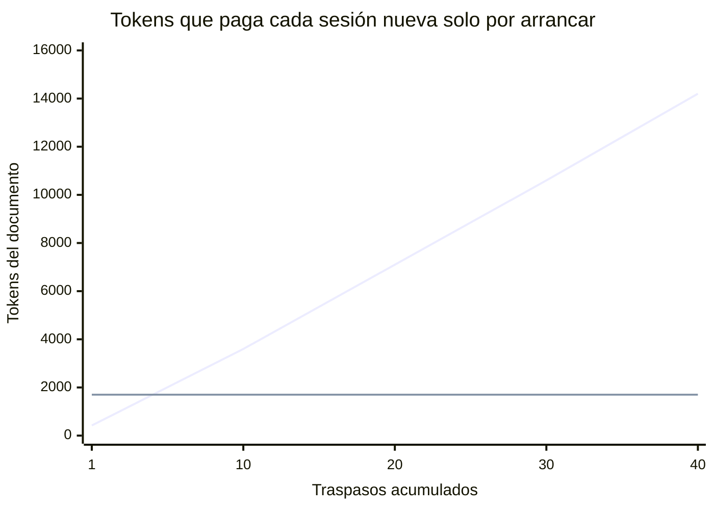
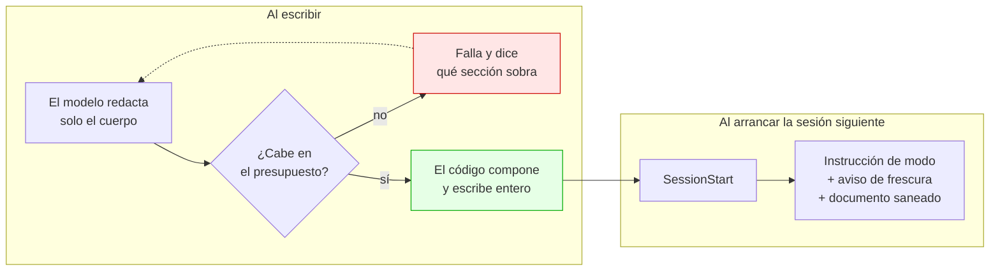
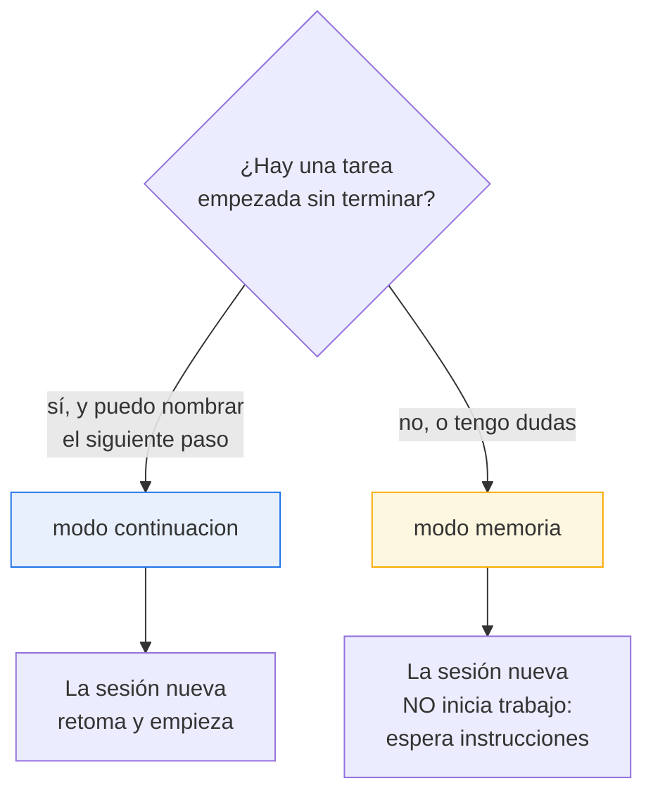
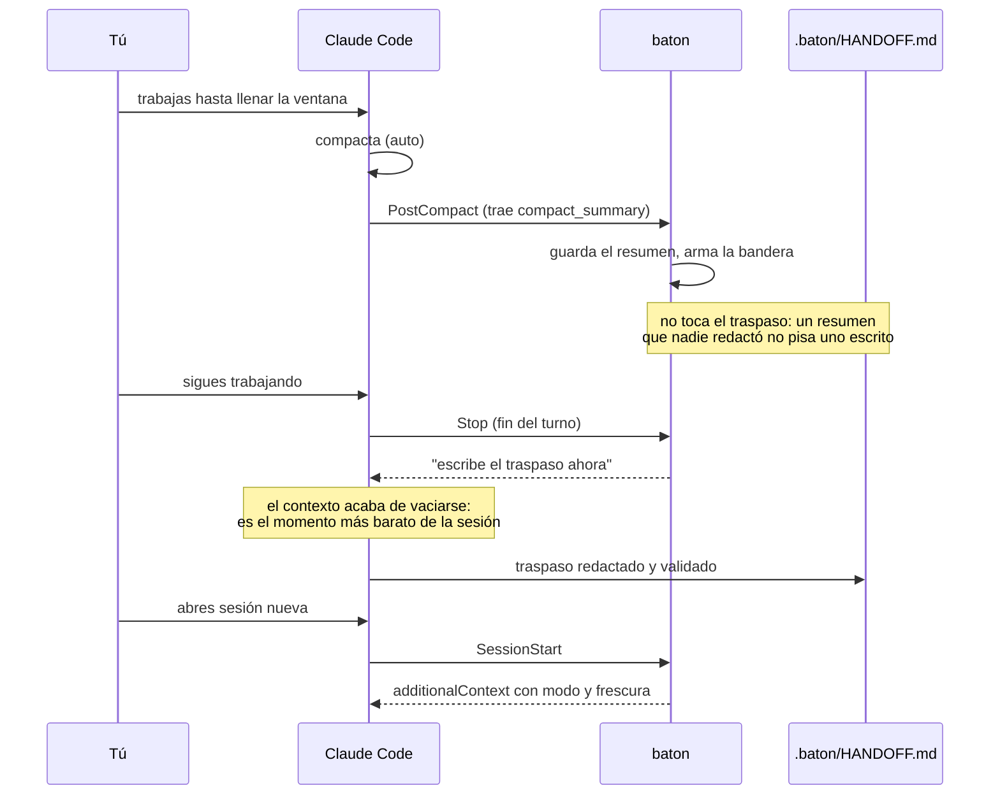
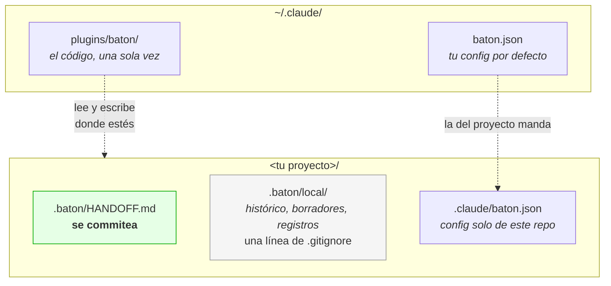
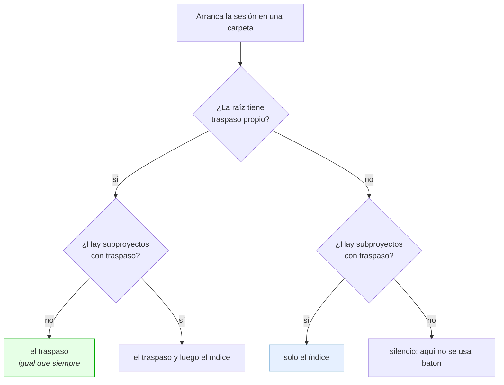

# baton

**Traspaso de contexto entre sesiones de Claude Code con un documento que no crece.**

*[English](README.md) · **Español***

[](tests/)
[](#requisitos)
[](LICENSE)

---

## El problema

Cuando una sesión de Claude Code se alarga, la calidad se degrada y toca abrir una
nueva. El traspaso es manual, y los plugins que lo automatizan comparten un fallo
medido: **el documento crece sin límite**.



La línea de arriba es un caso real: **931 líneas ≈ 14.200 tokens**. El documento
que existía para *ahorrar* contexto acabó siendo el mayor consumidor de contexto
del arranque.

Y hay algo peor, verificado en el binario de Claude Code 2.1.259: el contexto que
un hook inyecta **se trunca a 8.000 caracteres o 200 líneas, y en silencio**.


Un traspaso así **no cabe**. Llega cortado por la mitad y nadie avisa: el modelo lee
media frase y la trata como si estuviera entera.

## Cómo lo resuelve baton



- **Se reescribe entero, nunca se añade.** Un fichero, sin entradas apiladas.
- **Presupuesto duro verificado por código**: 120 líneas / 6.000 caracteres,
  derivados hacia atrás desde el techo real del harness. Si no cabe, el comando
  **falla y obliga a recortar** — no trunca a media frase, porque un traspaso
  cortado miente.
- **Secciones opcionales de verdad.** Si no hay bloqueos, la sección *no existe*.
  Nada de «Bloqueos: ninguno»: los huecos son por donde engordan los demás.
- **Los datos de git los pone el código**, no el modelo: rama, commit, ficheros sin
  commitear, fecha. Exactos y sin gastar presupuesto.

## Los dos modos

Este es el diferenciador, y ningún plugin equivalente lo tiene: los demás asumen
que siempre hay trabajo a medias, así que la sesión nueva arranca sola y toca lo
que nadie pidió.



| | `continue` | `memory` |
|---|---|---|
| Cuándo | Hay tarea a medias | Hay progreso, nada que continuar |
| Exige `Siguiente paso` | Sí, el código lo verifica | No |
| La sesión nueva | Confirma y empieza | Saluda y **espera** |

Ante cualquier ambigüedad —frontmatter roto, documento corrupto, versión
desconocida— baton cae a `memory`. Un documento ilegible nunca puede autorizar a
continuar trabajo.

## El ciclo automático

Cuando el harness compacta solo, tú no estás pensando en traspasar. baton sí.



**Por qué después de compactar y no antes.** Antes estás al 70-80 % de la ventana:
redactar ahí es caro y la propia redacción puede disparar la compactación que
intentabas anticipar. Después, el contexto está recién vaciado.

`PreCompact` no sirve para esto: en la compactación no hay turno de modelo. El
propio binario lo dice al rechazar los hooks que requieren conversación —
*"no conversation context is available"*.

**Como mucho una interrupción por compactación**, con anti-bucle nativo
(`stop_hook_active`) y un cooldown de 30 minutos configurable.

**El resumen es insumo, nunca producto.** Un resumen de compactación real ocupó
**12.780 bytes** frente a un presupuesto de 6.000 caracteres. Guardarlo tal cual
como traspaso —lo cómodo, y lo que haría un diseño ingenuo— duplicaría el tope y
ni siquiera cabría en el techo de 8.000. En su lugar se destila: esa misma sesión
produjo un traspaso de 45 líneas, 2.763 caracteres inyectados.

## Frescura: avisar, nunca caducar

Un traspaso de hace días con commits encima miente. Al inyectarlo, baton compara
con git y lo dice:

> `[baton] Aviso de frescura: este traspaso se escribió hace 6 días, en la rama`
> `feature/cupones, y ahora estás en main. Desde entonces hay 14 commits nuevos y`
> `9 ficheros cambiados. Da por incierto lo que diga del estado del código.`

También detecta que el commit desapareció (rebase o squash). **Nunca caduca**: un
proyecto parado dos semanas no invalida su traspaso, solo hay que saber que es
viejo. Y si no hay nada que decir, no gasta ni una línea.

## Instalación

```bash
claude plugin marketplace add mrshelll/baton
claude plugin install baton@baton
```

> [!IMPORTANT]
> **Reinicia Claude Code después de instalar.** Los hooks se cargan al arrancar:
> sin reinicio no disparan, y un hook que no dispara no da error — no da nada.
> Es el error número uno.

Comprueba que quedó bien:

```bash
/hooks                                    # baton en SessionStart, PostCompact y Stop
python3 "${CLAUDE_PLUGIN_ROOT}/scripts/baton.py" doctor
```

## Uso

```bash
/baton                    # baton elige el modo
/baton memoria            # fuerzas "solo ten esto presente"
/baton continuacion       # fuerzas "sigue por aquí"
```

Y para inspeccionar:

```bash
python3 "${CLAUDE_PLUGIN_ROOT}/scripts/baton.py" ver        # resumen y coste
python3 "${CLAUDE_PLUGIN_ROOT}/scripts/baton.py" doctor     # por qué no funciona
```

## Cómo se ve un traspaso

```markdown
---
baton: 1
mode: continue
fecha: 2026-09-03T00:54:51-05:00
rama: feature/cupones
commit: a3f9c21
---
<!-- Generado por baton. Se REESCRIBE ENTERO en cada /baton. -->

## Contexto
- rama `feature/cupones`, 3 sin commitear: src/pagos.ts, src/cupon.ts, tests/pagos.test.ts
- ultimo commit `a3f9c21` feat: valida el cupón antes de cobrar (2026-09-02)

## Estado
Migrando el cobro de Stripe Charges a PaymentIntents. `src/pagos.ts` ya usa
PaymentIntents en el camino feliz y sus 4 tests pasan. Falta reembolso y webhook.

## Decisiones y su porque
- Idempotency key = `pedido_id`, no UUID nuevo — un reintento no puede cobrar dos veces.
- El cupón se valida antes de crear el PaymentIntent — si no, quedan intentos huérfanos.

## Siguiente paso
Implementar `reembolsar(pedido_id)` en `src/pagos.ts:214` con la misma idempotency key.

## Trampas
- `paymentIntents.confirm` devuelve 200 con `status: "requires_action"`. No es éxito.
```

**22 líneas de 120.** El frontmatter y `## Contexto` los pone el código; el modelo
solo escribe de `## Estado` hacia abajo.

## Dónde vive todo



Añade **una sola línea** a tu `.gitignore`:

```gitignore
.baton/local/
```

**Instalas una vez, a nivel de usuario, y funciona en todos tus proyectos.** baton
no lleva un registro de proyectos: cada hook recibe el directorio de la sesión y
trabaja ahí. En un proyecto donde nunca corriste `/baton`, el plugin está instalado
pero **inerte**: no crea ficheros ni escribe nada. El primer `/baton` lo activa.

Y **no necesitas git**. Si el proyecto es un repo, baton aprovecha rama y commits.
Si no lo es, funciona igual sin esos datos.

## Varios proyectos en una carpeta

A veces abres la sesión en una carpeta que *contiene* proyectos en vez de ser uno
— una carpeta de cliente, una fábrica de software, un monorepo. baton lo maneja
sin que declares nada:

**Un proyecto es cualquier carpeta bajo la raíz con su propio
`.baton/HANDOFF.md`.** La convención de rutas da igual; las carpetas sueltas y las
agrupadas se mezclan sin problema:

```
CLIENTE-X/                         RAIZ/
├── radar/                         ├── proyectos/
│   └── .baton/HANDOFF.md   ✓      │   ├── uno/.baton/HANDOFF.md   ✓
├── portal/                        │   └── dos/.baton/HANDOFF.md   ✓
│   └── .baton/HANDOFF.md   ✓      ├── suelto/.baton/HANDOFF.md    ✓
└── notas/                  ·      └── .baton/HANDOFF.md           ✓ (la raíz)
```

Al arrancar recibes un **índice**, no un documento: qué proyectos hay, en qué
modo y de cuándo son. No concede nada ni autoriza nada — todavía no has recibido
el contexto de ninguno.



Cuando dices en cuál trabajas, el modelo ejecuta `baton.py load <nombre>` y
recibe ese traspaso con el mismo envoltorio, el mismo aviso de frescura y el
mismo presupuesto que habría aplicado el hook. Eso además lo marca como **el
proyecto activo de la sesión**, así que un `/baton` a secas escribe ahí.

La activación vive una sesión: un arranque nuevo la limpia, una compactación la
conserva. Con varios proyectos y ninguno cargado, `/baton` los lista y se detiene
en vez de adivinar — lo que se estaría adivinando es qué traspaso se sobrescribe.

El escaneo mira **dos niveles hacia abajo** por defecto, que cubre las dos formas
de arriba. Si tus proyectos están más hondos, se dice una vez en la config de la
raíz:

```json
{ "discovery": { "depth": 3 } }
```

Escanear más hondo cuesta tiempo real en cada arranque de cada proyecto del
disco, y por eso es una decisión y no un valor por defecto. `baton.py doctor`
reporta hasta dónde miró, qué encontró y cuál es el proyecto activo.

## Configuración

Todo es opcional. `~/.claude/baton.json` para tu preferencia general,
`<proyecto>/.claude/baton.json` para un repo concreto (este manda).

```json
{
  "limits": { "lines": 120, "characters": 6000, "tokens": 1700 },
  "document": ".baton/HANDOFF.md",
  "history_max": 10,
  "inject_on": ["startup", "clear", "compact", "resume", "fork"],
  "cooldown_minutes": 30,
  "receipt": true,
  "language": "es",
  "discovery": { "depth": 2, "max_dirs": 400 }
}
```

| Clave | Por defecto | Qué hace |
|---|---|---|
| `limits.characters` | `6000` | **Vinculante**: es lo que mide el harness |
| `limits.lines` | `120` | La que un humano ve y sabe arreglar |
| `limits.tokens` | `1700` | Informativa, no rechaza por sí sola |
| `document` | `.baton/HANDOFF.md` | Relativa a la raíz; sin `..` ni absolutas |
| `history_max` | `10` | Versiones previas guardadas; `0` desactiva |
| `inject_on` | los cinco | En qué arranques se inyecta |
| `cooldown_minutes` | `30` | Mínimo entre dos peticiones automáticas |
| `receipt` | `true` | La línea que prueba que el hook disparó |
| `language` | `en` | Idioma de todo lo que lee un humano |
| `discovery.depth` | `2` | Cuántos niveles se buscan proyectos (1-4). **Solo en la raíz** |
| `discovery.max_dirs` | `400` | Tope de carpetas miradas por escaneo |

Un fichero de config roto no impide usar baton: avisa nombrando el fichero y sigue
con los valores buenos. Si escribes `lineas_max`, te sugiere `limits.lines`.

## Seguridad

`.baton/HANDOFF.md` se commitea y viaja con el repo, así que **quien clone un repo
ajeno se inyecta en su contexto lo que ese fichero diga**. baton lo trata como
entrada no confiable:

- Se eliminan caracteres de control, secuencias ANSI, marcas bidi y espacios de
  ancho cero.
- El contenido **no puede cerrar su propia etiqueta** para escaparse del bloque.
- Va precedido de una advertencia explícita de que es un documento de datos y no
  instrucciones.
- El modo se lee **solo** del frontmatter, que escribe el código: un cuerpo que
  finja otro modo no cambia nada.

## Comprobar que tu instalación funciona de verdad

Los tests unitarios no ven los fallos que solo aparecen en una instalación real.
Estas cinco comprobaciones sí, y son las que destaparon el bug de frescura de la
0.3.1 que 211 tests unitarios no habían visto. Llevan dos minutos.

**1. El hook dispara.** Abre una sesión en un proyecto donde hayas usado `/baton`.
La línea de arranque debe decir:

```
SessionStart:startup says: baton: handoff injected -- memory mode, N lines
```

Si no aparece, el hook no disparó. Ejecuta `doctor`.

**2. El modo memoria — la que define el producto.** Con un traspaso en `memory`,
abre una sesión nueva y escribe algo trivial y sin relación, por ejemplo `hola`.

- ✅ Saluda en una línea y espera.
- ❌ Abre ficheros, propone un plan, o pregunta «¿seguimos con X?».

**3. El canario — demuestra que el contexto llegó al modelo, no solo al fichero.**
Mete una línea como `canary: xylophone-7731` en `## Estado` y pregunta a una sesión
nueva *qué dice el canario*. Si responde, la inyección funciona. Si no, el traspaso
llegó al fichero pero nunca al contexto: el fallo que ningún test unitario ve.

**4. El ciclo automático.** Ejecuta `/compact`. Tras tu siguiente intercambio baton
debería pedirte el traspaso solo, y **no volver a pedirlo**. Comprueba el rastro:

```bash
cat .baton/local/log.jsonl
```

```
stop          -> silent: nothing pending        (antes de compactar: no molesta)
post-compact  -> summary saved, handoff pending (guarda y arma)
stop          -> handoff requested              (pide, una vez)
```

**5. Dos proyectos en una carpeta.** Crea `<raiz>/a/` y `<raiz>/b/` y ejecuta
`/baton a` y `/baton b` desde una sesión abierta en `<raiz>`.

- Abre una sesión nueva en `<raiz>`: recibes el **índice**, sin cuerpo de ningún
  proyecto. Pregunta por el canario de `a` — todavía no debe saberlo.
- Di *trabajemos en a*: el modelo ejecuta `baton.py load a`, y solo entonces
  responde el canario.
- Ejecuta `/baton`: debe escribir en `<raiz>/a/.baton/HANDOFF.md` y decir esa ruta.
- `baton.py doctor` lista los dos proyectos y nombra a `a` como activo.

## Cuando no funciona

Un hook que no dispara no da error: no da nada. Por eso hay cuatro capas:

1. **El recibo** — una línea al inyectar. Si no la ves, no disparó.
2. **La bitácora** (`.baton/local/log.jsonl`) — es lo único que distingue *«no
   disparó»* de *«disparó y calló porque no había documento»*: idénticos desde
   fuera, con causas opuestas.
3. **`doctor`** — comprueba hooks, `python3`, `git`, si el plugin está habilitado y
   si hay actividad reciente. Si no la hay, lista las causas por probabilidad,
   empezando por «instalaste sin reiniciar».
4. **El silencio significa una sola cosa**: no hay documento. Cualquier otro
   problema avisa nombrando el fichero.

## Requisitos

Python 3 (stdlib, **cero dependencias**) y Claude Code. `git` es opcional.

## Desarrollo

```bash
./tests/run.sh
```

284 tests con `unittest` de la stdlib: **sin Claude Code y sin instalar nada**. Los
de hooks invocan el script como subproceso con stdin JSON, igual que el harness,
porque es la única forma de cubrir el contrato real. Los proyectos temporales se
crean bajo una ruta con espacio y tilde, para que el caso raro sea el caso base.

## Lo que baton no hará nunca

Añadir al final del documento en vez de reescribirlo · escribir secciones con
«ninguno» · caducar un traspaso · abrir la sesión nueva por ti · hooks
`PostToolUse` o `UserPromptSubmit` · un `Stop` que te interrumpa fuera del momento
posterior a una compactación · una segunda implementación en bash.

## Licencia

MIT
