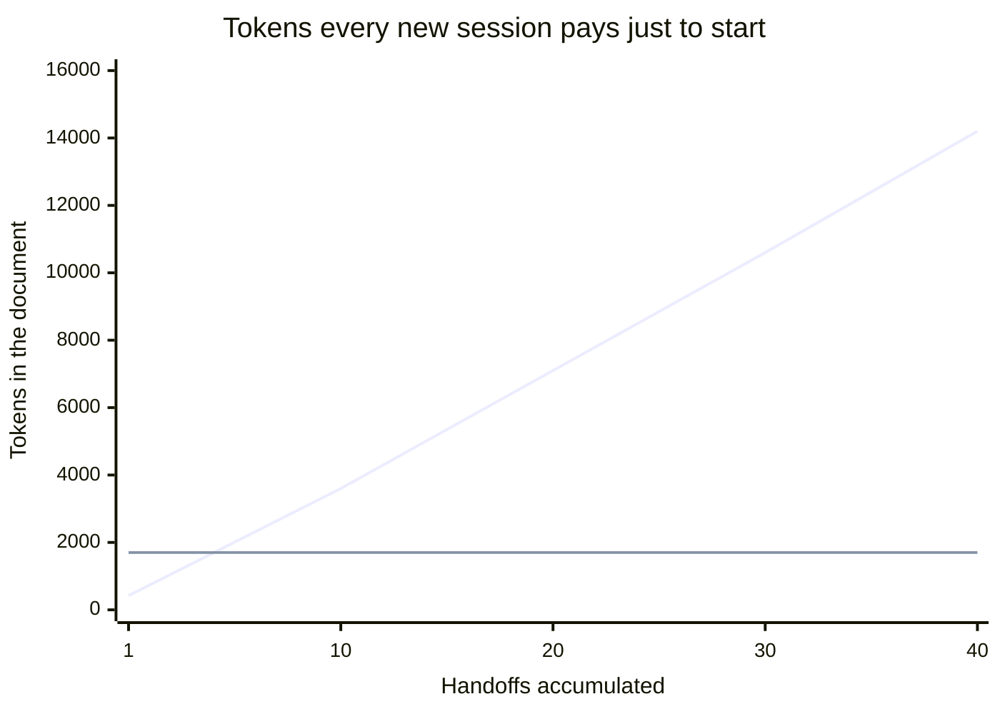
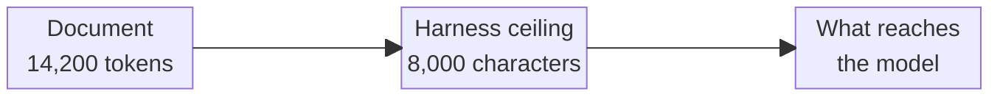
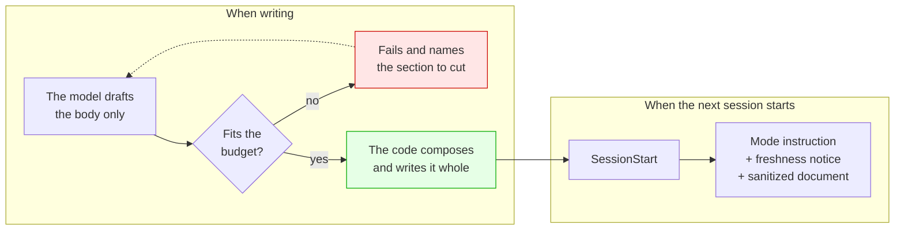
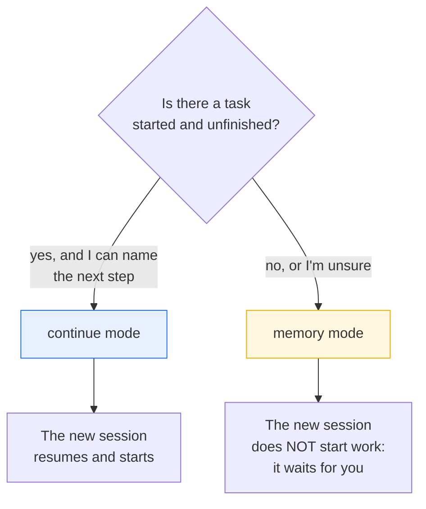
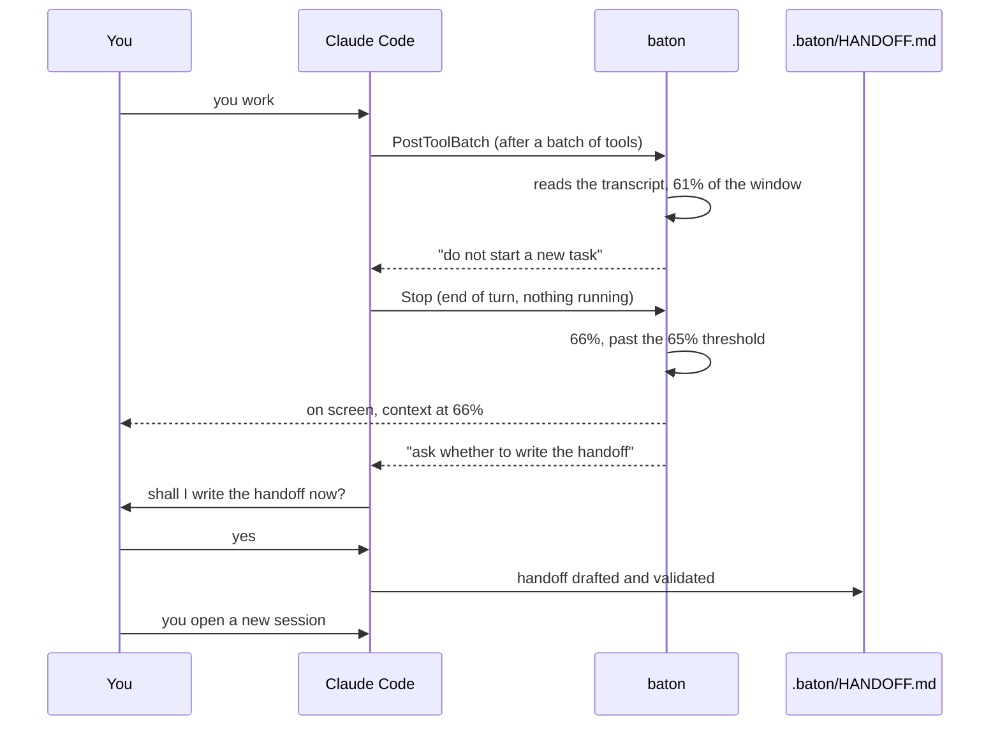
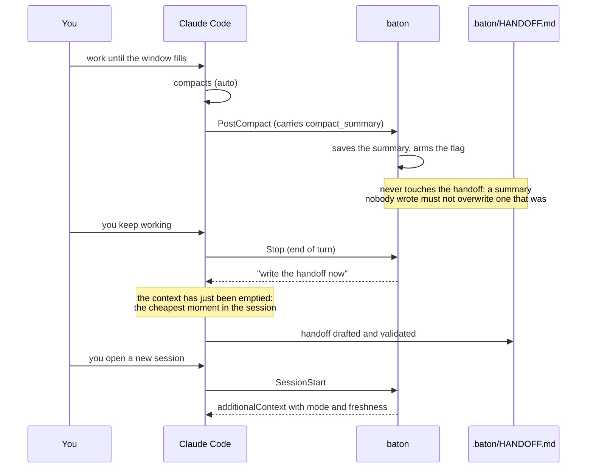
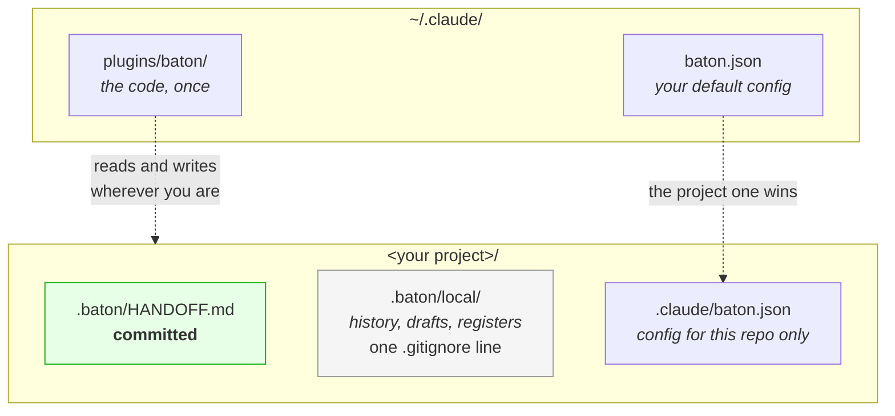
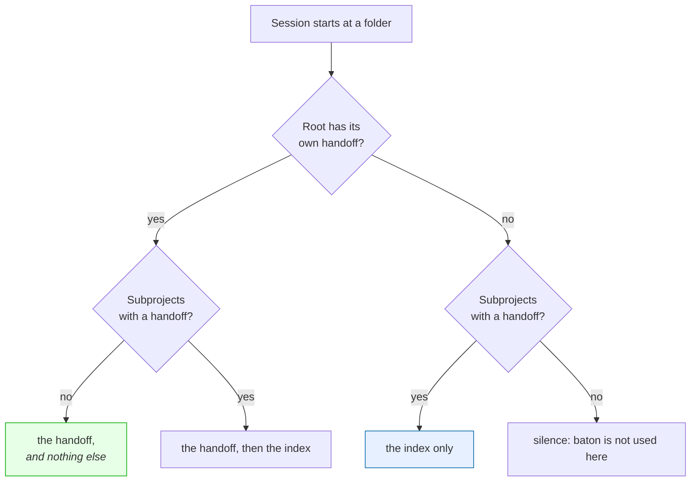

# baton

**Context handoff between Claude Code sessions, with a document that doesn't grow.**

***English** · [Español](README.es.md)*

[](tests/)
[](#requirements)
[](LICENSE)

---

## The problem

When a Claude Code session runs long, quality degrades and you need to start a
fresh one. The handoff is manual, and the plugins that automate it share one
measured flaw: **the document grows without bound**.



The upper line is a real case: **931 lines ≈ 14,200 tokens**. The document that
existed to *save* context became the single largest consumer of context at
startup.

And it gets worse. Verified against the Claude Code 2.1.259 binary, the context a
hook injects is **truncated at 8,000 characters or 200 lines, silently**.



A handoff that size **does not fit**. It arrives cut in half and nobody says so:
the model reads half a sentence and treats it as whole.

## How baton solves it



- **Rewritten whole, never appended to.** One file, no stacked entries.
- **A hard budget enforced by code**: 120 lines / 6,000 characters, derived
  backwards from the harness's real ceiling. If it doesn't fit, the command
  **fails and names the section to cut** — it never cuts mid-sentence, because a
  truncated handoff lies. On the third failed attempt baton writes a minimal
  handoff itself, keeping the required section and declaring the trim inside the
  document: a cut that says so beats a model looping on a budget it cannot meet.
- **Genuinely optional sections.** No blockers? The section *doesn't exist*. No
  "Blockers: none": empty sections are where the others put on weight.
- **Git facts come from the code**, not the model: branch, commit, uncommitted
  files, date. Exact, and free of budget.

## The two modes

This is the differentiator, and no equivalent plugin has it: the others assume
there is always unfinished work, so the new session starts on its own and touches
what nobody asked for.



| | `continue` | `memory` |
|---|---|---|
| When | A task is half done | Progress made, nothing to continue |
| Requires `Next step` | Yes, the code enforces it | No |
| The new session | Confirms and starts | Greets and **waits** |

Waiting is not silence. Say *let's carry on* or *where were we* and a `memory`
session tells you what the document leaves open and asks which to take — without
opening a file, because telling is not starting.

On any ambiguity — broken frontmatter, corrupt document, unknown version — baton
falls back to `memory`. An unreadable document can never authorise continuing
work.

## The automatic cycle

While you work you aren't thinking about handoffs. baton is, at two moments, both
at the end of a turn, when nothing is running: when the context window starts to
fill, and right after the harness compacts.

### Before the harness compacts: the context window

A compaction is the harness deciding for you what survives of the conversation,
and it decides when the window is full, not when you are ready to stop. baton gets
there first:



- **At 60%**, after a batch of tools, the model is told once not to start a new
  task and to finish the one in progress.
- **At 65%**, when the turn ends — the one moment nothing is running, no tool and
  no subagent — baton asks the model to **ask you**, in one line, whether to write
  the handoff. Nothing is written until you answer. Say no and it will not ask
  again at that threshold.
- **At 85%**, if you carried on anyway, it asks once more, and the handoff is
  rewritten whole: the one from 65% has aged.

**How it knows how full the window is.** Hooks receive no figure about the
context. The session transcript does: every answer records the `usage` of its
request, and `input_tokens + cache_creation_input_tokens + cache_read_input_tokens`
is exactly the context that request occupied — the same sum the statusline
paints. The window size comes from the model: baton carries the table Claude Code
itself uses, and reads the model from the transcript *with* its `[1m]` suffix,
because `message.model` never carries it. The frontier does not follow the family
— within Opus it moves at 4.7, within Sonnet at 5 — which is why it is a table and
not a rule.

A model newer than the table starts at 200k and is **learnt**: a session that
reaches N tokens is proof the window holds at least N, so the size only ever goes
up. `CLAUDE_CODE_MAX_CONTEXT_TOKENS`, `CLAUDE_CODE_AUTO_COMPACT_WINDOW`, Claude
Code's `autoCompactWindow` setting and `context_window.budget_tokens` all win over
the table.

**Why the thresholds stop at 95.** Drafting a handoff costs a few thousand tokens.
At 65% that is nothing; at the very edge it could trigger the compaction it exists
to get ahead of.

### After the harness compacts

If the window trigger was switched off, turned down or outrun by one very long
turn, the compaction still comes. baton catches that too:



**Why ask right after it.** The context has just been emptied and the summary is
fresh: it is the cheapest moment in the session to draft.

`PreCompact` cannot do this: a compaction has no model turn. The binary itself
says so when it rejects hooks that need a conversation — *"no conversation
context is available"*.

**At most one interruption per threshold and per compaction**, with the harness's
native loop guard (`stop_hook_active`) and a 30-minute cooldown that both reasons
share — what it protects is you, not a mechanism. When both are due at once the
compaction wins: its summary is the better material, and the threshold stays
available.

**The summary is input, never the product.** A real compaction summary measured
**12,780 bytes** against a 6,000-character budget. Storing it as the handoff — the
easy thing, and what a naive design would do — would double the cap and not even
fit the 8,000-character ceiling. It gets distilled instead: that same session
produced a 45-line handoff, 2,763 characters injected.

## Freshness: flag it, never expire it

A handoff from days ago with commits on top lies. On injection, baton compares
against git and says so:

> `[baton] Freshness notice: this handoff was written 6 days ago, on branch`
> `feature/coupons, and you are now on main. Since then there are 14 new commits`
> `and 9 changed files. Treat anything it says about the code as uncertain.`

It also detects that the commit is gone (rebase or squash). **It never expires**:
a project idle for two weeks doesn't invalidate its handoff, you just need to
know it is old. And when there is nothing to say, it spends no lines.

**It also says when it is repeating itself.** A handoff that reaches a session
which already received it arrives with the count and the date of the last time.
Work that has not moved is not news, and without that line the new session reads
it as though it were.

## What you see when a session starts

The handoff goes to the model's context, which means it never reaches your
screen. So baton prints what the session left behind, on the receipt line, before
you type anything:

```
baton: handoff injected -- memory mode, 47 lines, written 2 h ago, and the code moved since
  Blockers
  1. The question that ended the session: do I carry on with the heavy one, do the four
     light ones first to bring the queue down, or do we stop?
  2. Security question still open: if they ever want to give someone access to only some
     venues, deciding that later costs far more than deciding it now.
  (also in the document: State, Decisions and why, Traps)
```

**Long items are wrapped, never cut.** A handoff cut mid-sentence lies, which is
the argument the whole plugin rests on, so the receipt spends its budget in whole
items and counts the ones that did not fit. The author's own numbering is kept —
they numbered the questions so an answer could name one — and a continuation line
hangs under the text it continues, so a marker at the left margin is visibly a new
item.

**It is extracted, never summarised.** baton writes no prose about your work: it
takes the section verbatim and cuts on whole lines. Which section depends on what
was left, because "what was left" is not always a question:

| The document has | You see |
|---|---|
| Blockers, or questions nobody answered | those, first |
| No blockers but a written next step | the next step |
| Neither, just a state | the state, which always says what is still missing |
| `continue` mode | the next step first, which is the point of the mode |
| Several projects and none loaded | the list, with mode and age |

The point is not the reading. It is that your first message stops being "let's
carry on" and becomes the actual decision. That is a better instruction, and it
is also what names the session in `/resume`: the name is generated from your
first message, before any reply, and it is generated once.

`receipt_lines` sets how many lines it may add under the first one. It is a cap,
not a target: a handoff with one thing left in it spends two lines whatever the
cap says. Set `0` for the first line alone.

Lines are wrapped to a readable measure, never to the full width of the window.
A wide terminal filled edge to edge is harder to read, and a line measured
against it overflows the indent the harness prints it inside — at which point
the terminal wraps the remainder to column zero, under nothing, undoing the
structure.

## Install

```bash
claude plugin marketplace add mrshelll/baton
claude plugin install baton@baton
```

> [!IMPORTANT]
> **Restart Claude Code after installing.** Hooks are loaded at startup: without
> a restart they never fire, and a hook that doesn't fire gives no error — it
> gives nothing. This is the number one failure.

Check it landed:

```bash
/hooks                                    # baton on SessionStart, PostCompact and Stop
python3 "${CLAUDE_PLUGIN_ROOT}/scripts/baton.py" doctor
```

## Use

```bash
/baton                                    # that is all of it
/baton do not resume, just remember this  # anything after it is a note for the model
```

baton picks the mode and works out which project the handoff belongs to. The
note is free text: what you want captured, or the mode you want.

And to inspect:

```bash
python3 "${CLAUDE_PLUGIN_ROOT}/scripts/baton.py" show      # summary and cost
python3 "${CLAUDE_PLUGIN_ROOT}/scripts/baton.py" doctor    # why it isn't working
```

`context`, `write` and `load` complete the CLI, and the skill is what runs them:
they are the steps of a `/baton`, not a second way to use it.

## What a handoff looks like

```markdown
---
baton: 1
mode: continue
date: 2026-09-03T00:54:51-05:00
branch: feature/coupons
commit: a3f9c21
---
<!-- Generated by baton. REWRITTEN IN FULL on every /baton. -->

## Context
- branch `feature/coupons`, 3 uncommitted: src/pay.ts, src/coupon.ts, tests/pay.test.ts
- last commit `a3f9c21` feat: validate the coupon before charging (2026-09-02)

## State
Migrating charging from Stripe Charges to PaymentIntents. `src/pay.ts` already uses
PaymentIntents on the happy path and its 4 tests pass. Refund and webhook are left.

## Decisions and why
- Idempotency key = `order_id`, not a fresh UUID — a client retry must not charge twice.
- The coupon is validated before creating the PaymentIntent — otherwise orphan intents pile up.

## Next step
Implement `refund(order_id)` in `src/pay.ts:214` using the same idempotency key.

## Traps
- `paymentIntents.confirm` returns 200 with `status: "requires_action"`. That is not success.
```

**22 lines out of 120.** The code writes the frontmatter and `## Context`; the
model only writes from `## State` down.

## Where everything lives



Add **one line** to your `.gitignore`:

```gitignore
.baton/local/
```

**Install once, at user level, and it works across every project.** baton keeps no
registry of projects: each hook receives the session's directory and works there.
In a project where you never ran `/baton`, the plugin is installed but **inert**:
it creates no files and writes nothing. The first `/baton` enables it.

And **you don't need git**. If the project is a repo, baton uses branch and
commits. If it isn't, it works the same without those facts.

## Several projects in one folder

Sometimes you open the session at a folder that *contains* projects rather than
being one — a client folder, a software factory, a monorepo. baton handles it
without you declaring anything:

**A project is any folder under the root with its own `.baton/HANDOFF.md`.** The
path convention is irrelevant; loose folders and grouped ones mix freely:

```
CLIENT-X/                          ROOT/
├── radar/                         ├── projects/
│   └── .baton/HANDOFF.md   ✓      │   ├── one/.baton/HANDOFF.md   ✓
├── portal/                        │   └── two/.baton/HANDOFF.md   ✓
│   └── .baton/HANDOFF.md   ✓      ├── loose/.baton/HANDOFF.md     ✓
└── notes/                  ·      └── .baton/HANDOFF.md           ✓ (the root)
```

At session start you get an **index**, not a document: which projects exist, in
what mode, how old. It grants nothing and authorises nothing — you have not
received anyone's context yet.



When you say which project you are working on, the model runs `baton.py load
<name>` and gets that handoff with the same wrapper, the same freshness notice
and the same budget the hook would have applied. That also marks it as **this
session's active project**, so a bare `/baton` writes there.

### You never type arguments

`/baton` takes none. The mode is the model's decision, and the target is worked
out from disk, in this order:

1. the project loaded with `load` this session,
2. the project the session is standing in — a project folder has its own
   `.baton/`, so baton stops there instead of climbing to the root.

Only two situations are left, and in both baton stops and says so rather than
guessing — the thing it would be guessing is which handoff gets overwritten.
Not even a root with exactly one project decides on its own: being the only
project on disk is not evidence that this handoff is that project's.

- **The first handoff of a project**, where nobody has decided yet whether it
  belongs to a subfolder or to the root — whether the session is standing in
  that folder, or at the root talking about it. A one-time decision, once per
  project, forever.
- **Several projects, none loaded**, when the session never said which it was
  about.

In both, the model asks you in one line and passes the flag itself. You answer
in words.

The activation lives one session: a fresh start clears it, a compaction keeps it.

The scan looks **two levels down** by default, which covers both shapes above. If
your projects sit deeper, say so once in the root's config:

```json
{ "discovery": { "depth": 3 } }
```

Deeper scans cost real time on every session start of every project on the
machine, which is why it is a decision and not a default. `baton.py doctor`
reports how deep it looked, what it found and which project is active.

## Configuration

All optional. `~/.claude/baton.json` for your general preference,
`<project>/.claude/baton.json` for one repo (that one wins).

```json
{
  "limits": { "lines": 120, "characters": 6000, "tokens": 1700 },
  "document": ".baton/HANDOFF.md",
  "history_max": 10,
  "inject_on": ["startup", "clear", "compact", "resume", "fork"],
  "cooldown_minutes": 30,
  "receipt": true,
  "receipt_lines": 12,
  "language": "en",
  "discovery": { "depth": 2, "max_dirs": 400 },
  "context_window": {
    "enabled": true, "watch_at": 60, "thresholds": [65, 85],
    "confirm": true, "budget_tokens": 0, "min_tokens": 40000
  }
}
```

| Key | Default | What it does |
|---|---|---|
| `limits.characters` | `6000` | **Binding**: the unit the harness truncates by |
| `limits.lines` | `120` | The one a human sees and can fix |
| `limits.tokens` | `1700` | Informational, never rejects alone |
| `document` | `.baton/HANDOFF.md` | Relative to the root; no `..`, no absolutes |
| `history_max` | `10` | Previous versions kept; `0` disables |
| `inject_on` | all five | Which session starts get the handoff |
| `cooldown_minutes` | `30` | Minimum between automatic requests |
| `receipt` | `true` | Whether baton prints anything on screen at session start |
| `receipt_lines` | `12` | Lines the receipt may add under the first; `0` for the first line alone |
| `language` | `en` | Language of everything a human reads |
| `discovery.depth` | `2` | How far down projects are looked for (1-4). **Root only** |
| `discovery.max_dirs` | `400` | Cap on directories examined per scan |
| `context_window.enabled` | `true` | The handoff asked for when the window fills |
| `context_window.watch_at` | `60` | % at which the model is told, once, to wrap up; `0` disables |
| `context_window.thresholds` | `[65, 85]` | % at which baton asks for the handoff at the end of a turn: 1 to 4 values, none above 95 |
| `context_window.confirm` | `true` | Ask you before writing; `false` writes straight away |
| `context_window.budget_tokens` | `0` | Window size in tokens; `0` works it out from the model |
| `context_window.min_tokens` | `40000` | Nothing fires below this many tokens, whatever the percentage says |

`cooldown_minutes` and `context_window` are read from the folder the session runs
in, not from a subproject loaded into it.

**Config keys stay in English in every language.** They are a machine interface,
and whoever types them shouldn't need to speak another one. `"language"` changes
what people read: section headings, messages, and the instructions injected into
the model. Currently `en` and `es` — adding one is a JSON file in `templates/`.

A broken config file never blocks baton: it warns naming the file and carries on
with the good values. Write `lines_max` and it suggests `limits.lines`.

## Security

`.baton/HANDOFF.md` is committed and travels with the repo, so **whoever clones
someone else's repo gets whatever that file says injected into their context**.
baton treats it as untrusted input:

- Control characters, ANSI sequences, bidi marks and zero-width spaces are stripped.
- The content **cannot close its own tag** to escape the block.
- It is preceded by an explicit warning that it is a data document, not instructions.
- The mode is read **only** from the frontmatter, which the code writes: a body
  faking another mode changes nothing.

**baton reads the session transcript.** To know how full the window is, the hooks
that run at the end of a turn and after a batch of tools read the end of the
transcript Claude Code keeps for the session (`transcript_path`): the last 256 KB,
and up to 16 MB when a few large tool results — images read, say — fill that on
their own. They also read its first 1 MB when the model's identity is not in the
tail. The lines are parsed in memory to find three numbers — the input counters
of the latest answer — and the model id. Nothing the conversation says is kept,
logged or sent anywhere: what reaches the disk is a token count per model in
`.baton/local/window.json`. The format is Claude Code's internal one and it will
change; when baton does not understand it, it stays quiet rather than guess.

## Checking your install actually works

Unit tests cannot see the failures that only appear on a real install. These five
checks can, and they are the ones that caught the freshness bug in 0.3.1 that 211
unit tests had missed. They take two minutes.

**1. The hook fires.** Open a session in a project where you have run `/baton`.
The startup line should read:

```
SessionStart:startup says: baton: handoff injected -- memory mode, N lines, written ...
```

Under it you should see what was left: blockers, a next step, or the state. No
line at all means the hook did not fire. Run `doctor`.

**2. Memory mode — the one that defines the product.** With a `memory` handoff,
open a fresh session and type something trivial and unrelated, like `hello`.

- ✅ It greets in one line and waits.
- ❌ It opens files, proposes a plan, or asks "shall we carry on with X?".

Then type `let's carry on`. It must tell you what the document leaves open and
ask which to take. "Context loaded, what do you want to do?" is the failure: you
just said what you want.

**3. The canary — proves the context reached the model, not just the file.** Put a
line like `canary: xylophone-7731` in `## State`, then ask a fresh session *what
does the canary say*. If it answers, the injection works. If it doesn't, the
handoff reached the file but never the context — the failure no unit test sees.

**4. The automatic cycle.** Run `/compact`. After your next exchange baton should
ask for the handoff on its own, and **not ask again**. Check the trail:

```bash
cat .baton/local/log.jsonl
```

```
stop          -> silent: nothing pending        (before compacting: no interruption)
post-compact  -> summary saved, handoff pending (saves and arms)
stop          -> handoff requested              (asks, once)
```

**5. Two projects in one folder.** Create `<root>/a/` and `<root>/b/`. From a
session opened at `<root>`, work on `a` and run `/baton`: it must ask in one line
whether the handoff belongs to `a` or to the root, and write to
`<root>/a/.baton/HANDOFF.md` when you say `a`. Then the same for `b`.

- Open a new session at `<root>`: you get the **index**, and no project body. Ask
  for the canary of `a` — it must not know it yet.
- Say *work on a*: the model runs `baton.py load a`, and only then does the canary
  answer.
- Run `/baton`: it must write to `<root>/a/.baton/HANDOFF.md` and print that path.
- `baton.py doctor` lists both projects and names `a` as active.

**6. The context window.** In a project where you have run `/baton`, put this in
`.claude/baton.json`, so the thresholds are crossed from the first turn:

```json
{ "context_window": { "watch_at": 1, "thresholds": [1, 85], "min_tokens": 0 } }
```

Ask for anything that uses a tool. When the turn ends you should see
`baton: context at N%` and the model should ask, in one line, whether to write the
handoff. Answer no: it carries on, and **does not ask again**. `baton.py doctor`
prints the last reading. If your statusline shows the context, the window size
must match it exactly; the tokens trail it by the last answer, because Claude Code
writes the transcript one step behind its hooks. Remove those lines when you are
done.

## When it doesn't work

A hook that doesn't fire gives no error: it gives nothing. Hence four layers:

1. **The receipt** — its first line on injection. No line, no fire.
2. **The log** (`.baton/local/log.jsonl`) — the only thing telling *"didn't fire"*
   apart from *"fired and stayed quiet because there was no document"*: identical
   from outside, opposite causes. Every turn's entry carries the context
   percentage. The one exception is the check after each batch of tools, which
   writes only when it speaks: it runs too often to log every time.
3. **`doctor`** — checks hooks, `python3`, `git`, whether the plugin is enabled
   and whether there is recent activity. If there isn't, it lists causes by
   likelihood, starting with "you installed without restarting".
4. **Silence means exactly one thing**: there is no document. Every other problem
   warns naming the file.

**"It never asked, and I was past 65%."** In order of likelihood: you already
said no at that threshold in this session; another request went out less than 30
minutes earlier (`cooldown_minutes`); or the window size is wrong. `doctor` prints
the last reading, the size it used and **where that size came from** — `model`,
`env`, `settings`, `config`, `calibrated` or `default`. Compare it with your
statusline: the window size must match exactly — the tokens trail it by the last
answer. If the size is wrong, set `context_window.budget_tokens`.

## Requirements

Python 3 (stdlib, **zero dependencies**) and Claude Code. `git` is optional.

## Development

```bash
./tests/run.sh
```

440 tests on the stdlib's `unittest`: **no Claude Code, nothing to install**. The
hook tests invoke the script as a subprocess with JSON on stdin, exactly like the
harness, because that is the only way to cover the real contract. Temporary
projects are created under a path with a space and an accent, so the awkward case
is the base case.

To validate the README diagrams against the real Mermaid parser:

```bash
npm install mermaid jsdom && node tools/validate-mermaid.mjs README.md
```

## What baton will never do

Append to the document instead of rewriting it · write sections saying "none" ·
expire a handoff · open the new session for you · `PostToolUse` or
`UserPromptSubmit` hooks · a `Stop` that interrupts with work in flight, or twice
at the same threshold · block anything after a batch of tools · a second
implementation in bash.

## Licence

MIT
